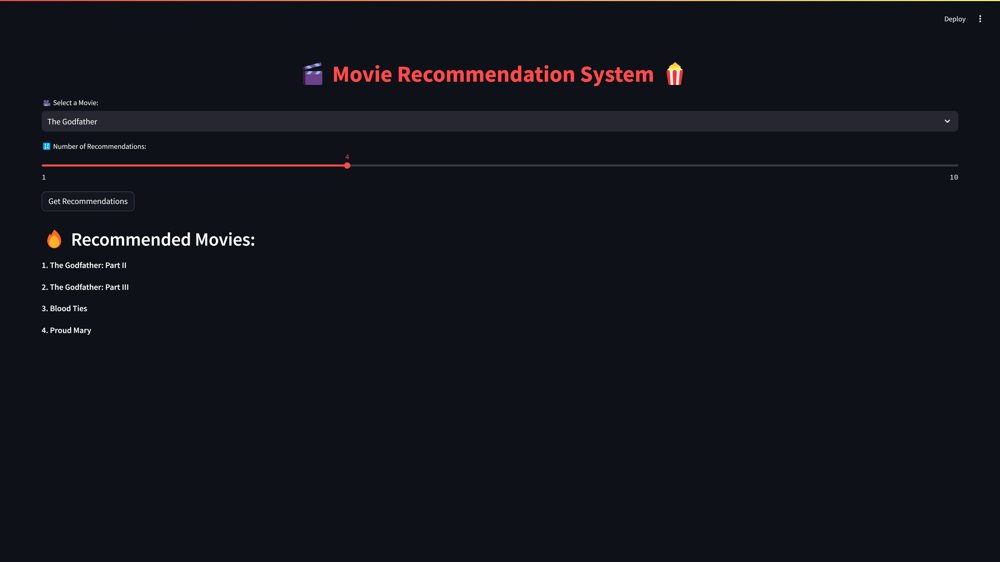

# 🎬 Movie Recommendation System

## 📌 Project Overview

This is a simple **Movie Recommendation System** built using **Cosine Similarity** and **TF-IDF (Term Frequency-Inverse Document Frequency)**. The system suggests movies based on the similarity of their descriptions or metadata, allowing users to discover similar films effortlessly.

## ⚡ Features

- 🔍 **Movie Search:** Users can select a movie from a dropdown list.
- 🎯 **Recommendation System:** Provides similar movie recommendations.
- 📊 **Cosine Similarity & TF-IDF:** Used for computing similarity between movie descriptions.
- 📌 **Streamlit UI:** A user-friendly interface for easy interaction.

## 🚀 Technologies Used

- **Python** 🐍
- **Streamlit** 🎨 (for UI)
- **Pandas** 🏛️ (for data manipulation)
- **Scikit-learn** 🧠 (for TF-IDF and similarity calculations)
- **Pickle** 📦 (for saving precomputed similarity matrices)

## 🏗️ How It Works

1. The dataset of movies is preprocessed and **TF-IDF** is used to convert text descriptions into numerical form.
2. **Cosine Similarity** is computed to measure how similar movies are based on their descriptions.
3. The precomputed similarity matrix (`cosine_similarity.pkl`) is used to quickly fetch recommendations.
4. The **Streamlit UI** allows users to select a movie and see recommendations.

## 📜 Future Improvements

- 📌 Include **movie posters** for better UI experience.
- ⚡ Use **Word Embeddings (e.g., BERT, Word2Vec)** for better similarity detection.
- 🛠️ Deploy on **AWS/GCP/Heroku** for public access.

